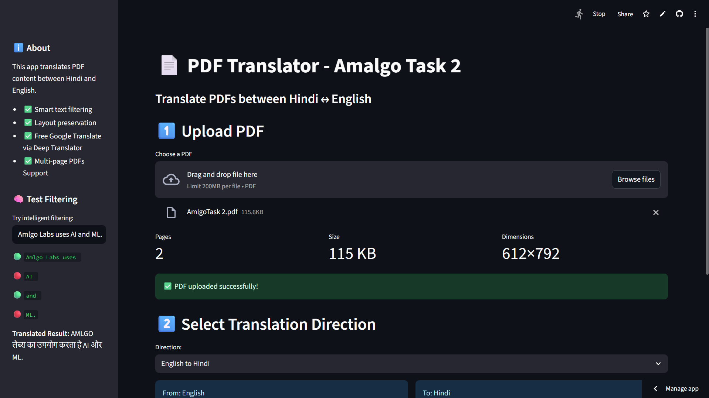
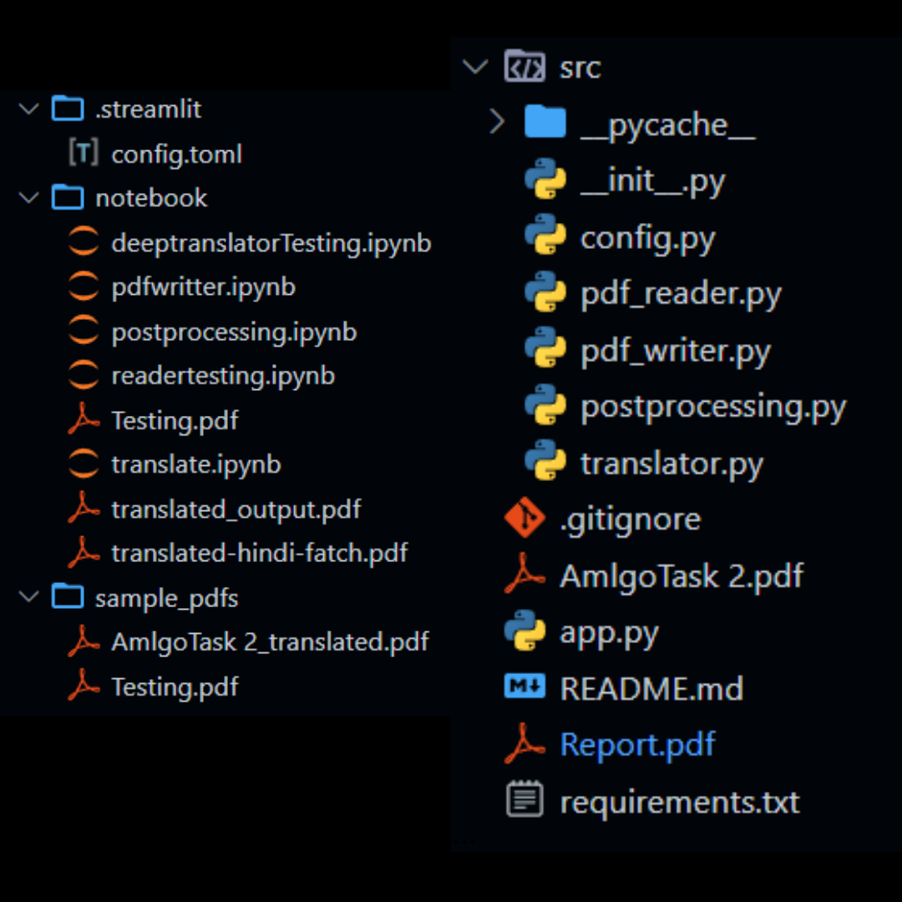

# 📄 PDF Translator (Hindi ↔ English)

This is a Streamlit-based web application that allows you to **translate PDF documents** between **Hindi and English**. The app supports intelligent text filtering, layout preservation, and a fallback mode for generating clean translated PDFs.


Working URL: https://amlgolabs-task2-pdf-translator.streamlit.app

Explanation: https://raw.githubusercontent.com/tushararora-dev/Amlgo_Task2_pdf_translator/refs/heads/main/Explanation.md

Appraoch PDF : https://github.com/tushararora-dev/Amlgo_Task2_pdf_translator/blob/main/Report.pdf

Video Explanation: https://youtu.be/E5rnNF_R-M4



## 🚀 Features

- 🔤 Translate PDFs from **English to Hindi** and **Hindi to English**
- 📑 Preserve **PDF structure**: formatting, font size, colors, and bullet points
- 🧠 Use **Deep Translator** (Libra, Google, Microsoft) with **no API key needed**
- 📊 Extract and display **PDF statistics**: word count, estimated language, character count
- 🔎 Skip translation for abbreviations like NASA, AI, ML
- 📚 Supports **multi-page PDFs**, highlights, and links
- 🖼️ Handles **images and colored text**
- 🧪 Tested for real-world PDFs

---

## 🛠️ Tech Stack

| Area               | Tech Used          |                                                
|--------------------|--------------------|
| **Language**       | Python 3.10        |                                                    
| **Frontend/UI**    | Streamlit          |                                                   
| **PDF Reading**    | `PyMuPDF (fitz)`   |                   
| **PDF Writing**    | `PyMuPDF`          |                                
| **Translation**    | `Deep Translator`  | 
| **Deployment**     | Streamlit Cloud    |                                             

---

## 📁 Project Structure


---

## 🔁 Pipeline Flow

1. Upload PDF
2. Extract text blocks (with formatting preserved)
3. Skip non-translatable items (e.g., NASA, AI)
4. Translate content (Hindi ↔ English)
5. Rebuild PDF with original layout + translated text
6. Download the final output

---

## 🧪 PDF Test Cases

The tool has been tested on PDFs containing:
- 🖍️ Highlighted text
- 🖼️ Images
- 🎨 Colored fonts
- 🔗 Links
- 🔡 Abbreviations (AI, ML, NASA)
- 📄 Multi-page documents
- 🔤 Mixed language (Hindi + English)

---

---

## 🔧 Improvements & TODOs

- [ ] Handle **multiple PDFs** (Batch translations)
- [ ] Use **Classes and OOP** structure
- [ ] Add **logging** and **exception handling**
- [ ] Add **database** to store PDFs and stats
- [ ] Improve UI (statistics, filtering, etc.)
- [ ] Add **DevOps** practices for CI/CD
- [ ] Build a **simple offline version** (no APIs/libraries)
- [ ] Handle **bold/large fonts** more precisely
- [ ] Use **Sessions** and **Timeouts** for concurrent users
- [ ] Add better **language detection**
- [ ] Add better **Preserver Colours**
- [ ] Support **OCR and Table recognition** with PaddleOCR / UniLM DiT
- [ ] Enable **multithreading** or **batch translation** to speed up processing

---

## 🧠 Advanced Functionality

✅ **No API Key Needed**  
Used `Deep Translator` which allows unlimited usage of Google, Microsoft, or Libre Translate.

✅ **Custom Translator Possible**  
Optionally, a custom translation model (Transformer-based) can be trained and used instead of prebuilt models or APIs.

---

## ⚙️ How to Run Locally

```bash
# Step 1: Create environment
conda create --name pdftrans python=3.10
conda activate pdftrans

# Step 2: Install dependencies
pip install -r requirements.txt
pip install streamlit pymupdf deep-translator

# Step 3: Launch the app
streamlit run app.py